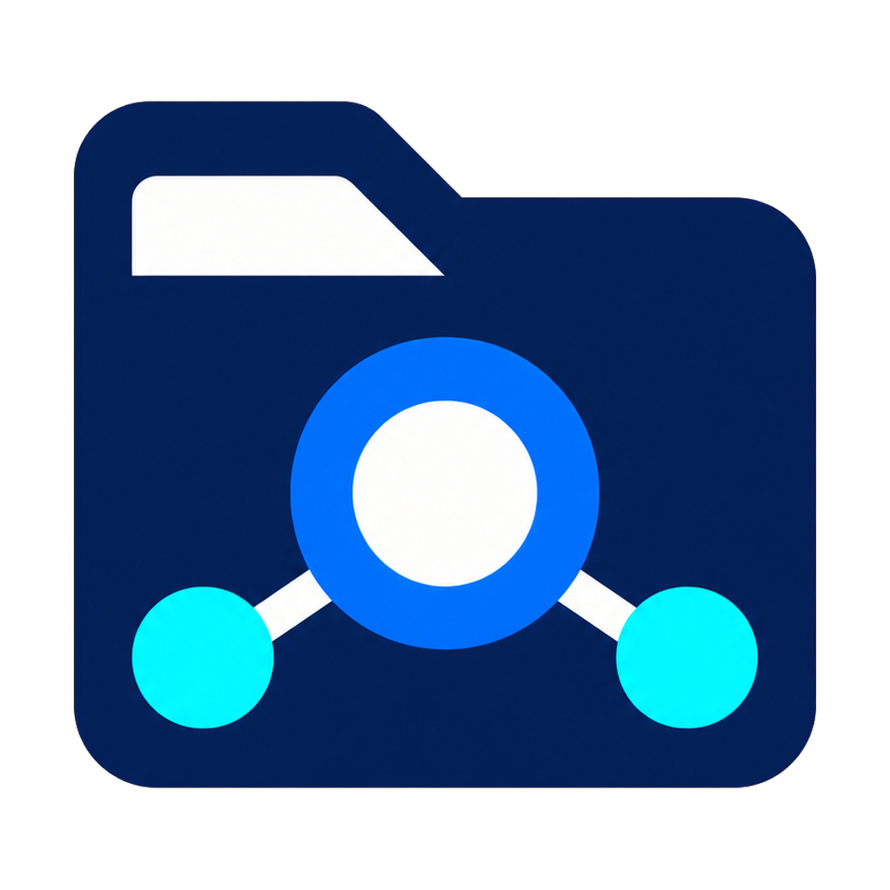

<p align="center">
  
</p>

# StorageHub

StorageHub is an open-source, security-first file manager, transfer client, and
synchronization engine for Windows. It is built with C# and .NET 10, uses the
CodeLogic application lifecycle, and adapts the all-in-one `CL.Storage`
(`CodeLogic.Storage`) provider library behind a provider-neutral contract.

> [!IMPORTANT]
> StorageHub is currently an engineering preview, not a finished file-manager
> release. Core browsing, saved-pane file transfers, queue execution, sync, and
> preview scheduling and explicit server-trust management are wired, but provider
> interoperability, directory jobs, code signing, and production stress/security gates remain. Do not
> use this revision as the only copy of important data.

## Install

Download the newest engineering preview from
[GitHub Releases](https://github.com/clausdk/StorageHub/releases). The Windows
release bundle contains:

- `StorageHub-<version>-win-x64-Setup.exe` — recommended one-click, per-user installer;
- `StorageHub-<version>-win-x64.msi` — per-user MSI for managed deployment; and
- `StorageHub-<version>-win-x64-portable.zip` — self-contained portable payload.

The installer does not require elevation, starts the background agent only as
the signed-in Windows user, and preserves application data under
`%LOCALAPPDATA%\StorageHub` when the program is updated or uninstalled. Scheduled
work therefore runs only while that user is signed in. Preview binaries are not
yet Authenticode-signed, so Windows SmartScreen may show an unrecognized-app
warning. Verify the files against the included `SHA256SUMS` before running them.

Every successful push to `main` creates a uniquely versioned prerelease after
the Release build, full test suite, dependency audit, packaging, silent install,
agent health, and silent uninstall checks pass. A failed check produces no
release.

Installed builds check the official StorageHub GitHub release feed at startup
and silently download integrity-checked updates by default. Settings can disable
automatic checks or downloads, exclude preview releases, or opt into silent
install-and-restart. Manual **Help > Check for Updates...** remains available
when automatic checks are disabled. Portable and developer builds never modify
an installation.

## What is implemented

- A root-safe storage model with strong identifiers, normalized relative paths,
  capability discovery, pagination, cancellation, and structured failures.
- A `CL.Storage` adapter with streaming reads, bounded-pipe writes, capability
  and error mapping, runtime-only connections, explicit streamed SHA-256,
  exact-version/metadata/tag adapters, atomic local publication through a
  reserved/scavenged staging namespace, and a real local-provider integration
  test. A disposable, SHA-256-pinned MinIO fixture applies the shared provider
  conformance and hostile-input suite to S3-compatible storage. Hash-locked
  user-space FTP fixtures cover plaintext FTP, explicit and implicit FTPS,
  generated certificate pins, and client-PFX authentication. A hash-locked
  AsyncSSH fixture covers SFTP password and encrypted-private-key authentication,
  plus managed SSH terminal open/write/read/resize/close on the same loopback
  server, host-key rotation, authentication substitution, and malformed pins. Opaque
  provider ETags are never treated as content hashes.
- Typed connection profiles split into **Storage** (Local, S3, FTP, FTPS, SFTP)
  and **Clients** (SSH), with a discriminator designed for future client types
  such as VNC. Profiles include independent folders and labels, favorites,
  per-connection options, PFX references,
  SSH private-key references, and optimistic concurrency in SQLite.
- A grouped Connection Manager tree rooted at Storage and Clients, with nested
  favorites, folders, and providers (plus disabled profiles), sorting by name,
  preserves provider badges and tag pills, and searches names, endpoints,
  folders, providers, states, and tags.
- A fail-closed profile connector that resolves vault secrets and trust records
  immediately before runtime registration. Local, S3 with system trust, FTP,
  FTPS with system trust or verified pins, and SFTP with verified host-key pins
  are mapped without persisting credentials through CodeLogic. Runtime root
  identities bind the profile revision, endpoint namespace, authentication
  principal/mode, vault revisions, and selected trust revisions without
  including credential values.
- Profile-revision-bound Connection Manager flows for verified FTPS certificate
  and SFTP host-key enrollment, explicit rejection, and atomic rollover. Trust
  targets are derived by the agent from the saved pinned profile; no certificate
  or host key is accepted on first contact.
- A structured Settings center includes catalog-driven Connections navigation
  for Storage, Clients, and an individual page for Local/UNC, S3, FTP, FTPS,
  SFTP, and SSH. Each provider page documents its endpoint, authentication,
  security fields, defaults, and trust behavior and opens Connection Manager
  preselected to that provider. SFTP/SSH host-key discovery can
  be manual, ask-before-fetch, or automatic; Connection Manager also exposes a
  direct **Fetch from host** action. Discovery performs no authentication and
  never stores trust—the presented SHA-256 fingerprint still requires explicit
  verification through a separate trusted channel.
- A managed SSH.NET terminal client launched from Connection Manager, with no
  PuTTY dependency. Sessions live in the background agent, use vault-backed
  authentication and verified host-key records, and expose bounded IPC for
  input, output, resize, and close. Its stateful VT renderer supports cursor
  addressing, clearing/editing commands, scroll regions, bold text, ANSI,
  256-color and true-color output, and bounded scrollback.
- A Windows DPAPI current-user vault with versioned envelopes, atomic updates,
  rotation, corruption detection, and zeroed secret leases.
- A WAL-mode SQLite foundation with cross-process-serialized migrations, foreign
  keys, `synchronous=FULL`, integrity checks, and a single-writer boundary.
  Schema v2 adds the durable scheduler store, schema v3 the durable transfer
  queue, schema v4 an immutable idempotent scheduler-completion journal,
  schemas v5-v7 the durable sync/outbox/execution stores, and schema v8 portable
  checksum evidence.
- Bounded any-to-any copy/move execution with source preconditions, optional
  digest verification, delete-after-verified-commit move semantics, and a
  SQLite queue with fenced claims, optimistic state transitions, checkpoints,
  retries, and interrupted-owner recovery. The Windows agent runs the durable
  queue and exposes enqueue/list/status/cancel/retry/reconcile IPC. Saved
  connection panes can enqueue file copy/move jobs with exact IDs; uncertain
  acknowledgements are retried idempotently once and then surfaced explicitly.
- Three-way sync classification, immutable SHA-256 plans, preview mode,
  capability preflight, deletion thresholds, and execution approvals bound to
  snapshots, verified roots, live capabilities, limits, and transfer options.
  SQLite-backed profiles, baselines, plans, runs, conflicts, executions, and a
  leased reliable outbox are composed into the agent and exposed through the
  desktop sync editor. Versionless files can acquire portable, budgeted SHA-256
  evidence during complete scans.
- A durable-scheduler core with Cronos-based time-zone/DST calculation,
  bounded concurrency, SQLite-backed lease fencing and renewal, no-overlap
  handling, authoritative post-lock timing, bounded renewal writes, idempotent
  completion, misfire policy, and queue-one behavior. A schedule manager can
  create, edit, enable, disable, and delete preview-only schedules; fenced
  occurrences enqueue durable sync previews and never approve unattended apply.
- A CodeLogic-hosted Windows agent with database and vault health checks plus a
  versioned, bounded, current-user-only named-pipe protocol for status, saved
  connection discovery/testing, paged read-only storage listing, optimistic
  profile CRUD, durable transfer operations, sync orchestration, and schedule
  management. Secret enrollment/rotation/deletion uses a separate typed,
  current-user-only pipe and returns only opaque vault references. Startup
  enforces one agent per Windows user and verifies current-user-only ACLs
  throughout its reparse-free data tree.
- A self-contained, per-user Windows distribution with coordinated desktop and
  background-agent startup, fixed-source GitHub release checks, persisted updater
  controls, integrity-checked silent update/restart, graceful update/uninstall
  shutdown, portable and installer artifacts, checksums, provenance attestation,
  and disposable-runner install/uninstall smoke tests.
- A modern high-DPI stock WinForms shell with StorageHub-owned Light, Dark, and
  System themes, top menus, dual browser panes,
  functional asynchronous local and remote browsing with history, filtering and
  bounded paging, saved-pane file transfer actions, durable queue/sync/schedule
  surfaces, a read-only paged object inspector for versions/metadata/tags,
  provider-aware connection editing with real save/edit/delete and vault
  enrollment actions, and background-agent monitoring.

The current implementation and remaining integration boundaries are tracked in
[Development status](docs/development-status.md). The original product brief is
retained in [plan.txt](plan.txt).

## Provider status

`CL.Storage` supplies native implementations without PuTTY or external transfer
executables. StorageHub exposes those implementations only through capability
checks; a provider is not considered complete merely because it exists in the
library.

| Provider | In `CL.Storage` | StorageHub profile model | End-to-end StorageHub coverage |
| --- | :---: | :---: | --- |
| Local directories and UNC paths | Yes | Yes | Real integration test |
| Amazon S3 and S3-compatible services | Yes | Yes | Hermetic MinIO interoperability and hostile-input test |
| FTP, explicit FTPS, implicit FTPS | Yes | Yes | Hermetic interoperability, pin/downgrade, and client-PFX tests |
| SFTP | Yes, via SSH.NET | Yes | Hermetic password/key interoperability and hostile host-key tests |
| SSH terminal client | Managed SSH.NET client | Yes | Hermetic open/write/read/resize/close test beside SFTP |
| WebDAV | Yes | Not yet | Pending |
| Azure Blob Storage | Yes | Not yet | Pending |
| Google Cloud Storage | Yes | Not yet | Pending |
| OpenStack Swift | Yes | Not yet | Pending |

## Prerequisites

- Windows and PowerShell
- [.NET SDK 10.0.302](global.json), or a later 10.0 patch accepted by
  `global.json`
- Git
- CPython 3.12 when running the local FTP/FTPS or SFTP fixtures; CI pins 3.12.10

The CodeLogic framework and `CL.Storage` provider library are restored from the
centrally pinned `CodeLogic` and `CodeLogic.Storage` NuGet packages.

## Restore, build, and test

```powershell
dotnet restore StorageHub.slnx --locked-mode
dotnet build StorageHub.slnx --configuration Release --no-restore
dotnet test StorageHub.slnx --configuration Release --no-build --no-restore
dotnet list StorageHub.slnx package --vulnerable --include-transitive --no-restore
```

Warnings are errors, package versions are centrally managed, and StorageHub
projects restore from committed lock files. CI runs the same Release build,
test, and NuGet vulnerability-audit path on Windows.

Run every disposable self-hosted provider fixture with one command:

```powershell
.\eng\run-provider-smoke.ps1
```

This starts pinned loopback MinIO, FTP/FTPS, and SFTP services, exercises their
real health/read/write behavior, and runs provider-neutral transfers between
each supported remote direction and Local storage. S3 is verified in both
directions. FTP/SFTP outbound create is verified to fail closed because those
protocols cannot provide StorageHub's required atomic create-if-absent guarantee.

## Run the current milestone

Start the background agent first:

```powershell
dotnet run --project src\StorageHub.Agent.Windows --configuration Release
```

Then start the desktop shell in another terminal:

```powershell
dotnet run --project src\StorageHub.Desktop.WinForms --configuration Release
```

The agent uses `%LOCALAPPDATA%\StorageHub` by default. Set
`STORAGEHUB_DATA_ROOT` before starting it to use an isolated development data
directory. `--run-once` performs startup and a clean shutdown; `--health` runs
the CodeLogic health path.

## Documentation

- [Architecture](docs/architecture.md)
- [Security model](docs/security-model.md)
- [Development status](docs/development-status.md)
- [Implementation roadmap](docs/roadmap.md)
- [Release engineering](docs/releasing.md)
- [Contributing](CONTRIBUTING.md)
- [Security policy](SECURITY.md)

## License

StorageHub is licensed under the [MIT License](LICENSE).
